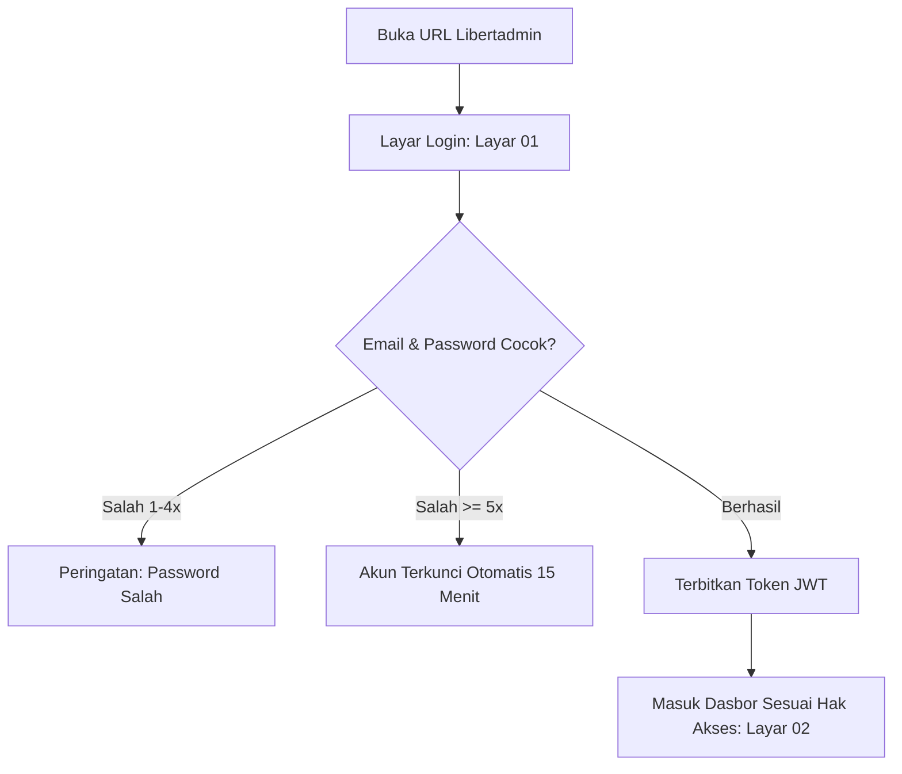
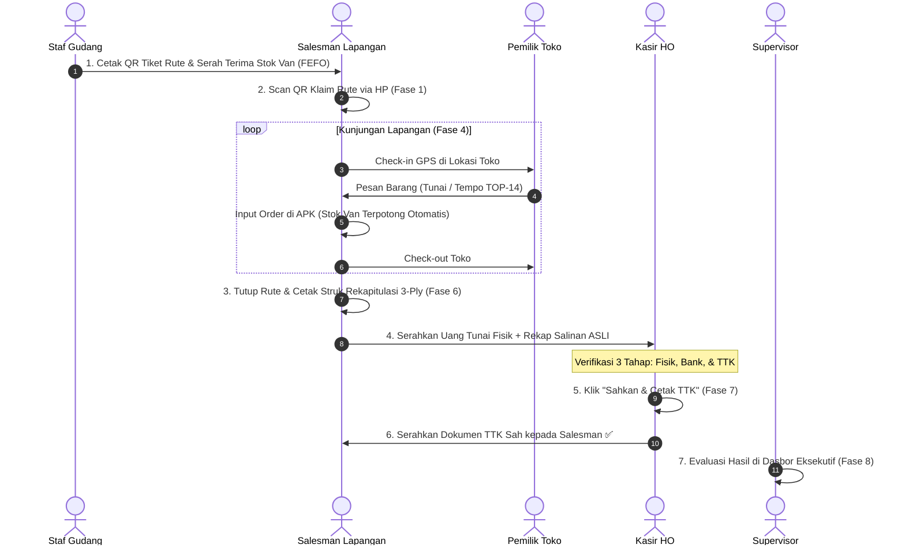

# 📗 BUKU PANDUAN PENGGUNA RESMI (MASTER HANDBOOK & SOP OPERASIONAL)
# EKOSISTEM LIBERTAAD ENTERPRISE RESOURCE PLANNING (ERP) & SFA

**Versi Dokumen**: 3.0.0-ENTERPRISE  
**Tanggal Terbit**: 26 September 2026  
**Klasifikasi Dokumen**: Buku Panduan Operasional Resmi (Standard Operating Procedure / SOP)  
**Lingkungan**: Production Server (`https://57.libertaad.my.id`) & Testing Lokal (`http://localhost:3000`)  
**Penerbit**: PT. Libertaad Berkah Alam — Departemen Teknologi Informasi & Rekayasa Sistem  
**Target Pembaca**: Seluruh Staf (Salesman, Kasir, Staf Gudang, Admin HO, Driver, Supervisor/Keuangan, & Direksi)  

---

## 📑 DAFTAR ISI UTAMA

1. [BAB I — ONBOARDING, MANAJEMEN SESI & KEAMANAN SISTEM](#bab-i--onboarding-manajemen-sesi--keamanan-sistem)
   - 1.1. Prasyarat Akses & Alamat URL
   - 1.2. Keamanan Token JWT & RBAC (Sesuai Audit A4 & A5)
   - 1.3. Prosedur Login, Logout & Proteksi Akun Terkunci
   - 1.4. Pengaturan Kunci Ganda (2FA Authenticator)
2. [BAB II — SOP 1 HARI PENUH OPERASIONAL BISNIS (MASTER WORKFLOW)](#bab-ii--sop-1-hari-penuh-operasional-bisnis-master-workflow)
   - 2.1. Peta Ringkas Alur 1 Hari (Fase F0 s/d F8: 06:30 – 17:00)
   - 2.2. Uraian Langkah Demi Langkah Lintas Peran
   - 2.3. Matriks Efek Agregat ke Sistem Libertadmin
   - 2.4. Prosedur Keadaan Darurat Lapangan & Rollback
3. [BAB III — PANDUAN KASIR: REKONSILIASI BSS & POS RETAIL](#bab-iii--panduan-kasir-rekonsiliasi-bss--pos-retail)
   - 3.1. Tugas 1: Rekonsiliasi Setoran Harian (Kasir Settlement)
   - 3.2. Prosedur Tiga Verifikasi (Uang Fisik, Bukti Transfer, TTK)
   - 3.3. Penanganan Status MATCH vs SELISIH
   - 3.4. Tugas 2: Transaksi Toko Langsung (POS Retail)
   - 3.5. Tugas 3: Pemeriksaan Riwayat Pelunasan
4. [BAB IV — PANDUAN ADMIN HEAD OFFICE: GROSIR, ONLINE & CUSTOM](#bab-iv--panduan-admin-head-office-grosir-online--custom)
   - 4.1. Tugas 1: Pemesanan Grosir Distributor (`HO_DISTRIBUTOR`)
   - 4.2. Penanganan Peringatan Otomatis "KREDIT TERKUNCI"
   - 4.3. Tugas 2: Pemesanan Marketplace E-Commerce (`HO_ONLINE`)
   - 4.4. Tugas 3: Pemesanan Produksi Khusus (`HO_CUSTOM`)
   - 4.5. Tugas 4: Pemantauan Rekapitulasi & Retur Penjualan
5. [BAB V — PANDUAN SALESMAN: APLIKASI SFA MOBILE & ALFASALES PWA](#bab-v--panduan-salesman-aplikasi-sfa-mobile--alfasales-pwa)
   - 5.1. Pagi: Klaim Tiket Rute (Scan QR)
   - 5.2. Kunjungan Toko: Check-in GPS, Input Order, & Alasan No-Order
   - 5.3. Manajemen Stok Van & Pengajuan Stock Request
   - 5.4. Pendaftaran Toko Prospek Baru (NOO)
   - 5.5. Sore: Penutupan Rute & Cetak Struk Rekapitulasi 3-Ply
   - 5.6. Penanganan Masalah Lapangan (Offline, Baterai, HP Rusak)
6. [BAB VI — PANDUAN GUDANG: STOK, FEFO & SURAT JALAN](#bab-vi--panduan-gudang-stok-fefo--surat-jalan)
   - 6.1. Tugas 1: Pemantauan Stok & Nilai Persediaan (Inventory Value)
   - 6.2. Tugas 2: Pemenuhan Permintaan Stok Sales (Fulfillment Van)
   - 6.3. Tugas 3: Pengambilan Barang Berurutan FEFO (Expired Terdekat)
   - 6.4. Tugas 4: Penerbitan Surat Jalan (Delivery Order / DO)
   - 6.5. Tugas 5: Penerimaan & Retur Barang Pabrik
   - 6.6. Tugas 6: Bahan Baku Produksi & Mutasi Antar Gudang
7. [BAB VII — PANDUAN DRIVER: SURAT JALAN & POD DIGITAL](#bab-vii--panduan-driver-surat-jalan--pod-digital)
   - 7.1. Tugas 1: Penerimaan Tugas Pengiriman & Cek Fisik Barang
   - 7.2. Tugas 2: Pengisian Form DRIVER POD DIGITAL di Toko
   - 7.3. Tanda Tangan Digital Toko, Catatan Kondisi & GPS Tagging
8. [BAB VIII — PANDUAN SUPERVISOR & MANAJEMEN: DASBOR & PENGAWASAN](#bab-viii--panduan-supervisor--manajemen-dasbor--pengawasan)
   - 8.1. Tugas 1: Pemantauan Harian Real-time Lewat Dasbor
   - 8.2. Tugas 2: Analisis 4 Pilar Laporan Operasional
   - 8.3. Tugas 3: Pengawasan Likuiditas, Piutang & Batas Kredit
   - 8.4. Tugas 4: Pengawasan Audit Log Aktivitas & Papan Kesehatan
9. [BAB IX — PANDUAN PERANGKAT LAPANGAN & PRINTER BLUETOOTH](#bab-ix--panduan-perangkat-lapangan--printer-bluetooth)
   - 9.1. Pemasangan Aplikasi (APK Libertaad SFA & PWA Alfasales)
   - 9.2. Konfigurasi Izin Android (Lokasi/GPS, Kamera, Baterai)
   - 9.3. Prosedur Pairing & Cetak Printer Thermal Bluetooth
   - 9.4. Pembaruan Aplikasi Otomatis (OTA dari Server Kantor)
10. [BAB X — BLUEPRINT MASTER & CHECKLIST 29 TANGKAPAN LAYAR](#bab-x--blueprint-master--checklist-29-tangkapan-layar)
    - 10.1. Matriks 29 Slot Screenshot (19 Web + 10 Mobile)
    - 10.2. Wireframe Visual & Blueprint Tata Letak UI Presisi
11. [BAB XI — BANK TANYA JAWAB LAPANGAN (QNA 50+ KASUS RIIL)](#bab-xi--bank-tanya-jawab-lapangan-qna-50-kasus-riil)
    - 11.1. Login, Akun & Perangkat (Semua Pengguna)
    - 11.2. Seputar Salesman & Aplikasi SFA
    - 11.3. Seputar Kasir & Settlement
    - 11.4. Seputar Gudang & Mutasi
    - 11.5. Seputar Driver & POD
    - 11.6. Seputar Admin Head Office & Supervisor
12. [BAB XII — GLOSARIUM: KAMUS ISTILAH OPERASIONAL (A–Z)](#bab-xii--glosarium-kamus-istilah-operasional-a-z)
13. [BAB XIII — LAMPIRAN KARTU SAKU 6 PERAN (SIAP CETAK A6)](#bab-xiii--lampiran-kartu-saku-6-peran-siap-cetak-a6)

---

## BAB I — ONBOARDING, MANAJEMEN SESI & KEAMANAN SISTEM

### 1.1. Prasyarat Akses & Alamat URL
Sistem Libertaad ERP dirancang berbasis antarmuka web modern (*Libertadmin Web Console*) dan aplikasi mobile lapangan (*Libertaad SFA Android* serta *Alfasales PWA*).

- **Web Konsol Kantor (Produksi)**: `https://57.libertaad.my.id`
- **Backend API (Produksi)**: `https://58.libertaad.my.id/api`
- **Lingkungan Lokal / Testing**: `http://localhost:3000` (Web) dan `http://127.0.0.1:5758/api` (API)
- **Browser yang Didukung**: Google Chrome, Microsoft Edge, Mozilla Firefox, atau Safari versi terbaru.

### 1.2. Keamanan Token JWT & RBAC (Sesuai Audit A4 & A5)
1. **Otentikasi Token Bearer**: Setiap pengguna yang berhasil masuk akan memperoleh *Access Token* JWT berumur 24 jam yang disimpan di `localStorage` dengan kunci `libertadmin.access`.
2. **Penegakan Garis Route (A4 Compliant)**: Seluruh 17 endpoint kritis di backend telah diproteksi dengan `requireAuth` langsung pada baris rute. Setiap pemanggilan tanpa header `Authorization: Bearer <TOKEN>` secara otomatis ditolak dengan kode status **`HTTP 401 UNAUTHORIZED`**.
3. **Role-Based Access Control (RBAC)**: Menu yang tampil di antarmuka disaring ketat berdasarkan wewenang jabatan:
   - `ROOT_SUPER_USER` & `ADMIN`: Konfigurasi sistem, manajemen akun, audit log.
   - `DIRECTOR` & `SUPERVISOR`: Laporan eksekutif, analisis BI, pengawasan limit kredit.
   - `FINANCE` & `ADMIN_KEUANGAN`: Kasir settlement, piutang toko, buku besar GL.
   - `ADMIN_GUDANG` & `WAREHOUSE`: Persediaan gudang, FEFO picking, surat jalan DO.
   - `SALES` & `CASHIER`: Penjualan langsung POS, HO sales, katalog produk.

### 1.3. Prosedur Login, Logout & Proteksi Akun Terkunci
1. **Login**: Buka halaman login web, masukkan email resmi (contoh: `admin@libertaad.id`) dan password dari IT.
   *Anda akan melihat*: Halaman login dengan logo Libertaad ERP dan form input email serta password.
   
   

2. **Proteksi Anti Brute-Force**: Jika salah memasukkan kata sandi sebanyak 5 kali berturut-turut, akun akan **terkunci otomatis selama 15 menit**. Ini adalah fitur keamanan terverifikasi, bukan kerusakan sistem.
3. **Reset Password**: Tidak disediakan menu ganti password mandiri demi keamanan. Reset wajib diajukan ke admin sistem melalui menu **"Pengguna"**. Setelah direset, seluruh sesi login lama otomatis terputus (*revoked*).
   
   

4. **Disiplin Logout**: Selalu klik tombol **"Keluar"** saat meninggalkan komputer kerja atau perangkat bersama.

### 1.4. Pengaturan Kunci Ganda (2FA Authenticator)
1. Buka menu **"Keamanan Akun"** (grup Sistem).
2. Klik **"Aktifkan 2FA"** → Pindai (*scan*) QR Code menggunakan aplikasi **Google Authenticator** atau **Authy** di ponsel pintar Anda.
3. Simpan *backup recovery code* yang diberikan di tempat aman.



---

## BAB II — SOP 1 HARI PENUH OPERASIONAL BISNIS (MASTER WORKFLOW)

Dokumen ini merupakan panduan kerja terpadu lintas divisi yang menghubungkan **Gudang (GDG)**, **Salesman (SLS)**, **Kasir (KSR)**, **Driver (DRV)**, dan **Supervisor (SPV)** dari jam 06:30 pagi hingga 17:00 sore.

### 2.1. Peta Ringkas Alur 1 Hari (Fase F0 s/d F8)

| Jam | Fase | Pelaku | Ringkasan Aksi Kerja | Dampak Utama di Sistem Libertadmin |
| :--- | :--- | :--- | :--- | :--- |
| **06:30** | **F0** | GDG | Buat rute harian, cetak QR tiket, cek stok | Menu *"Rute, Promo & Prospek"* bertambah rute hari ini |
| **07:00** | **F1** | SLS | Buka APK Libertaad SFA ➔ **Klaim Tiket Rute (QR)** | Status rute di web berganti menjadi *Berjalan* |
| **07:15** | **F2** | SLS | Cek stok van ➔ Kirim **"+ Stock Request"** bila kurang | Antrean baru di menu *"Permintaan Stok (Sales)"* |
| **07:30** | **F3** | GDG | Ambil barang FEFO ➔ Serah terima fisik ke sales | Status *"✓ Stok sudah diterima sales"*; stok gudang turun |
| **08:00–14:00** | **F4** | SLS | Toko: **Check-in ➔ + Buat Order ➔ Check-out** | Stok van turun; order masuk laporan; piutang TOP bertambah |
| **10:00** | **F5** | GDG/DRV| Terbitkan Surat Jalan ➔ Isi **DRIVER POD DIGITAL** | Status DO berganti menjadi *Terkirim/Diterima* |
| **15:00** | **F6** | SLS | **"Selesai — Rute Baru"** ➔ Cetak Struk Rekap 3-Ply | Rute terkunci; antrean muncul di *"Kasir Settlement"* (PENDING) |
| **16:00** | **F7** | KSR+SLS| Setor uang fisik + rekap ASLI ➔ Sahkan & cetak **TTK** | Status PENDING bergeser; order LUNAS; **Sales terima TTK** ✅ |
| **17:00** | **F8** | SPV | Buka menu Dasbor & Laporan untuk tutup buku harian | Seluruh angka omzet harian terisi otomatis |

### 2.2. Uraian Langkah Demi Langkah Lintas Peran



### 2.3. Matriks Efek Agregat ke Sistem Libertadmin
1. **"Rute, Promo & Prospek"**: Rute dibuat ➔ diklaim ➔ berjalan ➔ selesai; posisi GPS kunjungan terekam otomatis.
2. **"Permintaan Stok (Sales)"**: Permintaan naik status hingga ditandai *"✓ Stok sudah diterima sales"*.
3. **"Stok Gudang" & "Kartu Stok"**: Saldo gudang berkurang sesuai kuantitas fulfillment van per batch FEFO.
4. **"Laporan Penjualan"**: Setiap pesanan toko masuk secara real-time tanpa perlu entri ulang oleh admin.
5. **"Piutang Usaha"**: Transaksi tempo TOP-14 otomatis menambah piutang toko; pelunasan kasir langsung menurunkan saldo piutang.
6. **"Kasir Settlement"**: Antrean setoran berstatus PENDING terbit saat salesman rekap; terkunci saat TTK disahkan.

### 2.4. Prosedur Keadaan Darurat Lapangan & Rollback
- **Salesman Gagal Scan QR**: Gudang mengirim ulang kode tiket rute atau membantu klaim dari konsol web. **Dilarang keras membuat rute kedua.**
- **Salah Input Order**: Batalkan order melalui tombol **"Batal"** pada dokumen terkait (sertakan alasan pembatalan). Stok van akan dikembalikan secara atomik oleh server (sesuai pengamanan A5).
- **Sinyal Internet Hilang di Toko**: Tetap lanjutkan penginputan. Aplikasi menyimpan data ke dalam antrean offline lokal HP dan mengirimkannya secara otomatis begitu sinyal pulih. Data dijamin tidak akan ganda karena dilindungi kunci idempoten unik.
- **Setoran Selisih**: Kasir dilarang memaksakan status cocok. Isi kolom *"Selisih:"* secara transparan dan laporkan ke Supervisor.

---

## BAB III — PANDUAN KASIR: REKONSILIASI BSS & POS RETAIL

*Audiens: Kasir Penjualan & Staf Keuangan*  
*Menu: `kasir-settlement.html` & `pos.html`*

### 3.1. Tugas 1: Rekonsiliasi Setoran Harian (Kasir Settlement)
Dilakukan setiap akhir hari kerja saat salesman kembali ke kantor pusat membawa uang setoran hasil penjualan van.

1. Buka menu **"Kasir Settlement"** di panel navigasi.
   *Anda akan melihat*: Daftar faktur berstatus **PENDING**, memuat kolom No. Faktur, Toko, Metode Bayar, Nominal, dan bagian **"Klaim SFA:"**.
   
   

2. Klik tombol **"Verifikasi"** pada baris setoran salesman. Muncul jendela verifikasi 3 tahap:
   - **Tahap 1: Verifikasi Fisik Uang Tunai**: Hitung uang tunai fisik yang diserahkan salesman dan bandingkan dengan nilai pada kolom *"Total Fisik Cash:"*.
   - **Tahap 2: Bukti Transfer Bank**: Cocokkan mutasi rekening koran bank dengan bukti transfer yang dilampirkan pelanggan.
   - **Tahap 3: Tanda Terima Kasir (TTK)**: Formulir pengesahan serah terima.
   
   

3. **Pemeriksaan Selisih**:
   - Jika nilai uang fisik tepat sama dengan hitungan sistem, status bernilai **MATCH (Hijau)**.
   - Jika ada perbedaan nominal, sistem memunculkan kolom **"Selisih:"** dan penanda **SELISIH (Merah)**. Jangan dipaksa cocok; ketik alasan selisih pada kolom catatan kasir.
   
   

4. **Pengesahan & Pencetakan TTK**:
   - Klik tombol **"Sahkan & Cetak TTK"**.
   - Sistem mencatat jurnal pelunasan kasir, mengupdate status order menjadi LUNAS, dan mencetak dokumen Tanda Terima Kasir (TTK) fisik.
   
   

5. **Serahkan Dokumen TTK Fisik kepada Salesman** sebagai bukti resmi bahwa setoran telah diterima secara sah oleh kasir HO. Ini adalah titik akhir SOP harian bagi salesman.

### 3.2. Tugas 2: Transaksi Toko Langsung (POS Retail)
Digunakan saat pelanggan umum atau pedagang datang langsung ke konter kasir pabrik/gudang untuk berbelanja tunai.

1. Buka menu **"POS Retail"** (ikon toko / `pos.html`).
   *Anda akan melihat*: Tampilan kasir modern dengan katalog barang di sisi kiri dan keranjang belanja di sisi kanan.
   
   

2. Pilih **Gudang Pengirim** (stok produk yang tampil otomatis disesuaikan dengan saldo gudang terpilih).
3. Pilih produk, tentukan jumlah kuantitas. Keranjang otomatis menghitung **Subtotal ➔ PPN (11%) ➔ Total Tagihan**.
4. Masukkan nominal uang yang diserahkan pembeli pada kolom *Uang Diterima*. Layar otomatis menampilkan nilai **Kembalian**.
5. Klik **"Proses Pembayaran"** untuk menerbitkan struk thermal belanja kasir.

### 3.3. Tugas 3: Pemeriksaan Riwayat Pelunasan
Buka menu **"Pelunasan"** (grup Keuangan).
*Anda akan melihat*: Daftar riwayat settlement historis untuk kebutuhan audit pembukuan.


---

## BAB IV — PANDUAN ADMIN HEAD OFFICE: GROSIR, ONLINE & CUSTOM

*Audiens: Admin Sales Kantor Pusat & Customer Service*  
*Menu: `ho-sales.html`*

### 4.1. Tugas 1: Pemesanan Grosir Distributor (`HO_DISTRIBUTOR`)
Digunakan saat distributor besar atau agen memesan barang dalam kuantitas karton/kontainer melalui telepon, WhatsApp, atau PO fisik.

1. Buka menu **Penjualan Head Office ➔ "Grosir Distributor"**.
   *Anda akan melihat*: Formulir pesanan grosir dengan 3 dropdown utama.
   
   

2. Pilih **"-- Pilih Gudang --"**, **"-- Pilih Pelanggan --"**, dan **"-- Pilih Produk --"**.
3. Masukkan item barang pada tabel **"Daftar Barang Belanja (Multi-Item)"**. Pilih satuan yang sesuai (**KRT** / **BOX**).
4. Masukkan diskon kemitraan pada kolom **"Diskon Tambahan:"**. Layar otomatis menghitung nilai **DPP (Dasar Pengenaan Pajak)** dan PPN 11%.
5. **AI Smart Reorder**: Perhatikan banner saran pemesanan ulang otomatis berdasarkan histori belanja rutin toko langganan.
6. ⚠️ **Peringatan Kredit Terkunci**:
   Jika muncul banner merah **"KREDIT TERKUNCI:"**, berarti toko tersebut telah melewati batas limit kredit atau memiliki nota macet > 14 hari. Sistem mengunci penerbitan pesanan secara otomatis. Arahkan pelanggan untuk menyelesaikan pelunasan dengan bagian keuangan.
   
   

7. Klik tombol **"Terbitkan Faktur Order HO"**. Nomor order terbentuk (format `ORD-...`) dan data diteruskan ke gudang untuk proses pengiriman.

### 4.2. Tugas 2: Pemesanan Marketplace E-Commerce (`HO_ONLINE`)
1. Klik tab **"E-Commerce Online"**.
2. Pilih saluran marketplace pada dropdown kanal: **Shopee**, **Tokopedia**, **TikTok Shop**, **Lazada**, atau **WhatsApp Official**.
   
   

3. Masukkan Nomor Pesanan Marketplace dan Nomor Resi Kurir (Airway Bill / AWB).
4. Masukkan potongan biaya komisi platform agar laporan omzet bersih tercatat secara akurat.
5. Klik **"Simpan Faktur Online"** untuk mereservasi stok barang di gudang online.

### 4.3. Tugas 3: Pemesanan Produksi Khusus (`HO_CUSTOM`)
Gunakan menu **"Produk Custom"** untuk pesanan dengan spesifikasi kemasan, formula khusus, atau *private label* instansi. Cantumkan rincian spesifikasi pada kolom catatan pesanan.

---

## BAB V — PANDUAN SALESMAN: APLIKASI SFA MOBILE & ALFASALES PWA

*Audiens: Salesman Canvas & Motoris Lapangan*  
*Aplikasi: Libertaad SFA (Android APK) & Alfasales (Web PWA)*

### 5.1. Pagi: Klaim Tiket Rute (Scan QR)
1. Buka aplikasi **Libertaad SFA** di ponsel Android Anda. Masukkan email dan kata sandi resmi.
   *Anda akan melihat*: Tampilan aplikasi dengan 4 tab navigasi bawah (**Rute · Toko · Stok Van · Riwayat**).
   
   

2. Buka tab **"Rute"**. Layar menampilkan pesan **"Tiket rute belum diklaim."** dengan tombol **"Klaim Tiket Rute (QR)"**.
   
   

3. Tekan tombol **"📷 Scan QR (kamera)"** dan arahkan kamera ponsel ke QR Code tiket rute yang disediakan gudang.
   *Anda akan melihat*: Indikator hijau **"Terdeteksi: ... Kode: ... Status: BERJALAN"**. Rute hari ini resmi aktif.
   
   

### 5.2. Kunjungan Toko: Check-in GPS, Input Order, & Alasan No-Order
1. Buka tab **"Toko"**. Pilih nama toko yang akan dikunjungi dari daftar rute harian.
2. Saat berada di depan toko, tekan tombol **"Check-in"**. Sistem mencatat koordinat lokasi GPS dan waktu kedatangan secara presisi.
   
   

3. **Membuat Pesanan**:
   - Jika toko memesan barang, tekan **"+ Buat Order"**.
   - Pilih produk dan jumlah kuantitas, tentukan metode pembayaran (`TUNAI` atau `TOP_14 Tempo Kredit`).
   - Layar menampilkan rincian: **"No: ORD-..."** dan **"Total: Rp ..."**. Tekan Simpan Order.
   
   

4. **Kunjungan Tanpa Belanja (No-Order)**:
   - Jika toko tidak melakukan pembelian, tetap lakukan Check-in.
   - Pilih **Alasan No-Order** (misal: *Stok Toko Masih Banyak*, *Pemilik Toko Sedang Keluar*, atau *Toko Tutup Sementara*). Kunjungan tetap terhitung sebagai kinerja kerja resmi (*Call Effective*).
5. Selesai urusan di toko, tekan tombol **"Check-out"**.

### 5.3. Manajemen Stok Van & Pengajuan Stock Request
1. Buka tab **"Stok Van"** untuk memeriksa sisa stok barang di kendaraan canvas Anda.
2. Jika stok menipis, tekan **"+ Stock Request"** ➔ Tekan **"+ Baris"** untuk memilih SKU produk dan kuantitas penambahan stok yang dibutuhkan.
   
   

3. Temui staf gudang untuk serah terima fisik barang. Begitu disahkan oleh gudang, status permintaan otomatis berubah menjadi **"✓ Stok sudah diterima sales"** dan saldo stok van Anda bertambah seketika.

### 5.4. Sore: Penutupan Rute & Cetak Struk Rekapitulasi 3-Ply
1. Setelah seluruh toko selesai dikunjungi, buka tab **Rute** ➔ Tekan tombol **"Selesai — Rute Baru"**.
2. Muncul jendela ringkasan rute harian. Hubungkan ponsel dengan printer thermal bluetooth Anda.
3. Cetak dokumen resmi **"STRUK REKAPITULASI RUTE CANVAS (3-Ply)"** yang mencetak 3 salinan berurutan:
   - Salinan 1: **"ASLI - SETORAN KASIR"** (Diserahkan ke kasir beserta uang fisik).
   - Salinan 2: **"SALINAN - SALES"** (Disimpan pribadi oleh salesman).
   - Salinan 3: **"ARSIP - GUDANG"** (Diserahkan ke staf gudang).
   
   

4. Periksa tab **"Riwayat Transaksi & Piutang TOP"** dengan filter **ALL / LUNAS / BELUM_LUNAS** untuk memastikan tagihan piutang dan pembayaran tunai tercatat serasi.
   
   

---

## BAB VI — PANDUAN GUDANG: STOK, FEFO & SURAT JALAN

*Audiens: Staf Logistik & Operator Gudang*  
*Menu: `Layout.jsx` Grup Gudang & Distribusi*

### 6.1. Tugas 1: Pemantauan Stok & Nilai Persediaan (Inventory Value)
Buka menu **"Stok Gudang"**.
*Anda akan melihat*: Rincian stok fisik per gudang (stok baik, stok rusak, dialokasikan, dalam transit) beserta nilai valuasi inventori (*Inventory Value*).


> **Aturan Emas Gudang**: Angka stok di Libertaad ERP **tidak pernah boleh diubah secara manual**. Setiap pergerakan stok wajib memiliki dokumen sumber resmi (DO, Stock Request, atau Penyesuaian Berita Acara yang disahkan supervisor).

### 6.2. Tugas 2: Pemenuhan Permintaan Stok Sales (Fulfillment Van)
1. Buka menu **"Permintaan Stok (Sales)"**.
   *Anda akan melihat*: Daftar pengajuan stok van dari salesman dengan status bertahap (*Diajukan ➔ Disetujui ➔ Dikeluarkan ➔ Siap Serah ➔ Diterima*).
   
   

2. Setujui permintaan dan keluarkan fisik barang dari rak gudang.
3. Saat serah terima dengan salesman, pastikan salesman mengonfirmasi terima di aplikasi HP-nya hingga penanda hijau **"✓ Stok sudah diterima sales"** muncul di layar konsol Anda.

### 6.3. Tugas 3: Pengambilan Barang Berurutan FEFO (Expired Terdekat)
Buka menu **"Daftar Pengambilan (FEFO)"**.
*Anda akan melihat*: Urutan pengambilan batch produk yang wajib didahulukan berdasarkan tanggal kedaluwarsa terdekat (*First Expired, First Out*). Ambil barang mengikuti panduan baris layar, bukan sembarangan mengambil dari rak terdekat.


### 6.4. Tugas 4: Penerbitan Surat Jalan (Delivery Order / DO)
1. Buka menu **"Surat Jalan"** (grup Gudang). Pilih order pesanan yang berstatus siap dikirim.
2. Klik tombol **"Terbitkan DO"** ➔ Klik **"Terbitkan & Picking"**.
   *Anda akan melihat*: Nomor DO resmi terbentuk dan instruksi picking diteruskan ke tim gudang.
   
   

### 6.5. Tugas 5: Penerimaan & Retur Barang Pabrik
Buka menu **"Pabrik (Isi Ulang/Retur)"**:
- Tekan **"+ Restock Pabrik"** saat menerima pasokan barang jadi baru dari pabrik.
- Tekan **"+ Retur Pabrik"** untuk mengembalikan barang rusak (*damaged stock*) ke pabrik pengolahan.

---

## BAB VII — PANDUAN DRIVER: SURAT JALAN & POD DIGITAL

*Audiens: Pengemudi (Driver) & Asisten Pengiriman*  
*Antarmuka: `driver-pod.html` (Mobile Browser)*

### 7.1. Tugas 1: Penerimaan Tugas Pengiriman
1. Pengemudi membuka tautan Surat Jalan (DO) yang dikirimkan kantor melalui browser ponsel.
2. Pastikan fisik karton dan nomor DO di surat jalan cocok dengan barang di dalam armada truk.

### 7.2. Tugas 2: Pengisian Form DRIVER POD DIGITAL di Toko
Saat tiba di lokasi toko pemesan:
1. Buka halaman **"DRIVER POD DIGITAL"** di browser HP.
   *Anda akan melihat*: Formulir bukti serah terima digital lengkap dengan indikator **"📍 GPS Tagging Ready"**.
   
   

2. **Lengkapi 4 Kolom Wajib (Bertanda *)**:
   - Nomor DO (contoh: `DO-2026-0924-001`).
   - **"Nama Driver Pengirim *"**: Nama pengemudi yang bertugas.
   - **"Nama Penerima di Toko / CP *"**: Nama asli staf/pemilik toko yang menerima barang.
   - **"Tanda Tangan Digital Penerima Toko *"**: Berikan ponsel kepada penerima toko untuk membubuhkan tanda tangan langsung di atas layar sentuh. Tekan *Clear TTD* bila tanda tangan keliru.
3. Masukkan catatan pada kolom *"Catatan Khusus Driver / Kondisi Barang"* (misal: *"Diterima 20 karton utuh tanpa cacat"*).
4. Tekan tombol **"Kirim Bukti Serah Terima (Submit POD)"**. Sistem mencatat tanda tangan digital, koordinat GPS pengiriman, dan mengubah status pesanan di kantor pusat menjadi `COMPLETED`.

---

## BAB VIII — PANDUAN SUPERVISOR & MANAJEMEN: DASBOR & PENGAWASAN

*Audiens: Supervisor, Kepala Cabang, Finance Manager, Direksi*  
*Menu: `Layout.jsx` Grup Laporan, Keuangan & Sistem*

### 8.1. Tugas 1: Pemantauan Harian Real-time Lewat Dasbor
Buka menu **"Dasbor"** di posisi paling atas. Layar menyajikan ringkasan real-time: Omzet Penjualan Hari Ini, Total Kunjungan Toko, Order Aktif, dan Sisa Persediaan tanpa perlu ketik ulang dari buku manual.


### 8.2. Tugas 2: Analisis 4 Pilar Laporan Operasional
Buka menu **"Dasbor & Laporan"** (grup Laporan). Pilih filter periode (*Harian / Mingguan / Bulanan*).
*Anda akan melihat*: 4 pilar data operasional lengkap:
1. **Laporan Penjualan**: Pendapatan kotor/bersih, jumlah order per salesman.
2. **Laporan Rute**: Kunjungan toko, jarak tempuh (km), rasio *Effective Call*.
3. **Laporan Stok**: Nilai inventori, stok baik (PCS), dan stok rusak.
4. **Piutang Baru**: Tagihan berjalan dan status pelunasan.


### 8.3. Tugas 3: Pengawasan Likuiditas, Piutang & Batas Kredit
- **"Piutang Usaha"**: Memantau umur piutang (*aging*) per toko (0–14 hari, 15–30 hari, macet).
- **"Pemeriksaan Kredit"**: Daftar batas kredit pelanggan. Toko yang melewati batas kredit otomatis berstatus **"KREDIT TERKUNCI"** dan tidak dapat memesan sebelum disetujui keuangan.
  
  

### 8.4. Tugas 4: Pengawasan Audit Log Aktivitas & Papan Kesehatan
- **"Log Aktivitas"**: Merekam jejak audit keamanan (*Audit Trail*) secara transparan: siapa melakukan apa, kapan, dan dari alamat IP mana.
- **"Papan Kesehatan"**: Memantau status koneksi basis data, latensi server, dan antrean sinkronisasi background.
- **"Keamanan Akun"**: Memeriksa daftar perangkat aktif yang terhubung dan mengelola status kunci ganda (2FA).
  
  

- **"Pengguna"**: Menu khusus administrator untuk mendaftarkan akun baru dan melakukan reset kata sandi staf.
  
  

---

## BAB IX — PANDUAN PERANGKAT LAPANGAN & PRINTER BLUETOOTH

### 9.1. Pemasangan Aplikasi
- **Aplikasi Android Libertaad SFA**: Unduh file APK dari server resmi kantor. Berikan izin pemasangan sumber tidak dikenal.
- **Aplikasi Alfasales PWA**: Buka alamat Alfasales di Chrome Android ➔ Tekan ikon titik tiga ⋮ ➔ Tekan **"Tambahkan ke layar utama"**.

### 9.2. Konfigurasi Izin Android Wajib
1. **Izin Lokasi (GPS)**: Wajib diatur ke **"Izinkan sepanjang waktu"**. Penolakan izin lokasi menyebabkan fitur Check-in toko dan POD gagal.
2. **Izin Kamera**: Wajib diizinkan untuk pemindaian QR tiket rute dan foto struk bukti bayar.
3. **Pengaturan Baterai**: Matikan mode penghemat baterai ekstrem (*Battery Saver*) untuk aplikasi Libertaad SFA agar pelacakan koordinat rute tidak tertidur saat layar HP mati.
4. **Waktu HP Otomatis**: Pastikan waktu ponsel diatur ke **"Otomatis dari Jaringan"**. Perbedaan jam ponsel dengan server akan menggagalkan handshake koneksi.

### 9.3. Prosedur Pairing & Cetak Printer Thermal Bluetooth
1. Nyalakan printer thermal portabel (58mm / 80mm).
2. Buka menu Bluetooth di HP Android Anda, lakukan *Pairing* dengan printer (PIN standar: `0000` atau `1234`).
3. Saat melakukan cetak struk di aplikasi SFA, dialog **Printer Bluetooth** akan muncul otomatis. Pilih nama printer yang telah dipasangkan.
4. Cetak dokumen secara berurutan: **"ASLI - SETORAN KASIR" ➔ "SALINAN - SALES" ➔ "ARSIP - GUDANG"**.

### 9.4. Pembaruan Aplikasi Otomatis (OTA Update)
Aplikasi Libertaad SFA memiliki fitur pembaruan mandiri dari server kantor (*Over-The-Air Update*). Begitu tim IT merilis versi baru, dialog pop-up konfirmasi pembaruan akan muncul otomatis di layar HP. Selesaikan transaksi berjalan, lalu klik **"Unduh & Pasang Update"**.


---

## BAB X — BLUEPRINT MASTER & CHECKLIST 29 TANGKAPAN LAYAR

Berikut adalah matriks master 29 tangkapan layar yang diposisikan secara presisi pada setiap langkah panduan, lengkap dengan representasi blueprint visual wireframe antarmuka:

### 10.1. Matriks 29 Slot Tangkapan Layar
| No | Kode Layar | Kategori | Penempatan di Panduan | Tautan Gambar Asset Standar |
| :--- | :--- | :--- | :--- | :--- |
| 1 | `01_login_awal` | Web | Bab I (§1.3 Prosedur Login) | `` |
| 2 | `02_dasbor_setelah_login` | Web | Bab VIII (§8.1 Dasbor Harian) | `` |
| 3 | `03_kasir_pending` | Web | Bab III (§3.1 Langkah 1) | `` |
| 4 | `04_kasir_popup_verifikasi`| Web | Bab III (§3.1 Langkah 2) | `` |
| 5 | `05_kasir_selisih` | Web | Bab III (§3.1 Langkah 3) | `` |
| 6 | `06_ttk_preview` | Web | Bab III (§3.1 Langkah 4) | `` |
| 7 | `07_pos_retail_keranjang` | Web | Bab III (§3.2 POS Retail) | `` |
| 8 | `08_pelunasan_riwayat` | Web | Bab III (§3.3 Pelunasan) | `` |
| 9 | `09_ho_grosir_form` | Web | Bab IV (§4.1 Grosir HO) | `` |
| 10 | `10_kredit_terkunci_banner`| Web | Bab IV (§4.1 Langkah 6) | `` |
| 11 | `11_ho_online_channel` | Web | Bab IV (§4.2 Online HO) | `` |
| 12 | `12_gudang_stok_value` | Web | Bab VI (§6.1 Stok Gudang) | `` |
| 13 | `13_gudang_permintaan_sales`| Web | Bab VI (§6.2 Permintaan Van)| `` |
| 14 | `14_gudang_fefo_picking` | Web | Bab VI (§6.3 FEFO Picking) | `` |
| 15 | `15_gudang_terbitkan_do` | Web | Bab VI (§6.4 Terbitkan DO) | `` |
| 16 | `16_supervisor_pemeriksaan_kredit`| Web| Bab VIII (§8.3 Limit Kredit)| `` |
| 17 | `17_supervisor_laporan_indikator`| Web| Bab VIII (§8.2 4 Pilar Laporan)| `` |
| 18 | `18_keamanan_akun_2fa` | Web | Bab VIII (§8.4 Keamanan 2FA)| `` |
| 19 | `19_pengguna_reset_password`| Web | Bab VIII (§8.4 Reset Sandi) | `` |
| 20 | `20_sfa_login_tabs` | Mobile| Bab V (§5.1 Login SFA) | `` |
| 21 | `21_sfa_klaim_rute` | Mobile| Bab V (§5.1 Klaim Rute) | `` |
| 22 | `22_sfa_scan_terdeteksi` | Mobile| Bab V (§5.1 Scan Kamera) | `` |
| 23 | `23_sfa_toko_checkin` | Mobile| Bab V (§5.2 Check-in Toko) | `` |
| 24 | `24_sfa_form_order` | Mobile| Bab V (§5.2 Form Order) | `` |
| 25 | `25_sfa_stock_request` | Mobile| Bab V (§5.3 Stock Request)| `` |
| 26 | `26_sfa_riwayat_piutang` | Mobile| Bab V (§5.4 Riwayat TOP) | `` |
| 27 | `27_sfa_struk_rekap_3ply` | Mobile| Bab V (§5.4 Struk Rekap) | `` |
| 28 | `28_driver_pod_form` | Mobile| Bab VII (§7.2 Form POD) | `` |
| 29 | `29_sfa_ota_update_prompt`| Mobile| Bab IX (§9.4 Prompt OTA) | `` |

---

## BAB XI — BANK TANYA JAWAB LAPANGAN (QNA 50+ KASUS RIIL)

### 11.1. Login, Akun & Perangkat (Semua Pengguna)
- **Q01: Saya belum punya akun, bagaimana mendapatkannya?**  
  *Jawab*: Akun dibuat oleh Administrator IT melalui menu *"Pengguna"*. Tanyakan ke atasan Anda dengan menyebutkan tugas/jabatan agar menu yang terbuka sesuai wewenang.
- **Q02: Lupa kata sandi?**  
  *Jawab*: Tidak ada menu reset mandiri di halaman login. Minta admin sistem melakukan reset kata sandi lewat menu *"Pengguna"*. Setelah direset, seluruh sesi login lama otomatis terputus (*revoked*).
- **Q03: Akun saya terkunci otomatis, kenapa?**  
  *Jawab*: Akun terkunci otomatis selama 15 menit jika Anda salah memasukkan kata sandi 5 kali berturut-turut. Ini adalah proteksi anti-pembobolan otomatis. Tunggu hingga masa kunci berakhir atau hubungi IT.
- **Q04: Mengapa menu di layar saya berbeda dengan rekan kerja?**  
  *Jawab*: Menu diatur oleh sistem hak akses peranan (*RBAC*). Kasir hanya melihat menu transaksi keuangan, staf gudang hanya melihat mutasi stok fisik.
- **Q05: Apakah boleh menggunakan akun bersama-sama (*sharing account*)?**  
  *Jawab*: **Dilarang keras.** Setiap aktivitas dicatat dalam *Audit Log* atas nama pengguna login. Segala selisih uang atau pesanan salah menjadi tanggung jawab penuh pemilik akun yang tertera.

### 11.2. Seputar Salesman & Aplikasi SFA
- **Q16: Apa urutan baku kerja salesman dalam 1 hari?**  
  *Jawab*: Pagi: Scan QR tiket rute ➔ Per toko: Check-in GPS ➔ Buat order / input no-order ➔ Check-out ➔ Sore: Selesai rute ➔ Cetak struk rekapitulasi 3-ply ➔ Serahkan uang tunai fisik & salinan ASLI ke kasir ➔ Terima TTK sah.
- **Q17: Tiket QR rute gagal dipindai terus-menerus?**  
  *Jawab*: Bersihkan lensa kamera, pastikan pencahayaan cukup, atau minta gudang mengirimkan kode rute untuk diklaim. Jangan pernah membuat rute baru sendiri.
- **Q20: Sinyal internet hilang saat berada di dalam toko pelanggan?**  
  *Jawab*: Tetap lanjutkan pengetikan order seperti biasa. Aplikasi otomatis menyimpan data ke dalam antrean lokal HP dan mengirimkannya sendiri saat sinyal kembali pulih.
- **Q22: Terlanjur salah memasukkan kuantitas barang pada order yang sudah terkirim?**  
  *Jawab*: Jangan membuat order tandingan kedua. Tekan tombol **"Batal"** pada order tersebut dan ketik alasan pembatalan. Stok van Anda akan dipulihkan secara otomatis oleh server.
- **Q33: Salesman memegang banyak uang tunai di jalan, bagaimana keamanannya?**  
  *Jawab*: Uang tunai menjadi tanggung jawab salesman sampai kasir menyerahkan dokumen **TTK** (*Tanda Terima Kasir*). Setor uang tepat waktu di akhir shift kerja.

### 11.3. Seputar Kasir & Settlement
- **Q39: Apa kewajiban utama kasir setiap sore hari?**  
  *Jawab*: Membuka menu *"Kasir Settlement"*, menyelesaikan seluruh antrean setoran berstatus **PENDING**, memvalidasi fisik uang tunai, memeriksa mutasi bank, dan mengesahkan kuitansi TTK.
- **Q41: Bukti apa yang wajib diserahkan salesman ke kasir?**  
  *Jawab*: Uang fisik (tunai), bukti transfer bank (jika ada), dan dokumen fisik struk rekapitulasi bertanda **"ASLI - SETORAN KASIR"**.
- **Q42: Jika jumlah uang fisik kurang dari hitungan sistem, apakah boleh disahkan?**  
  *Jawab*: **Dilarang dipaksa cocok.** Masukkan nominal selisih pada kolom *"Selisih:"*, ketik catatan penyebab selisih, dan laporkan kepada Supervisor.

### 11.4. Seputar Staf Gudang
- **Q46: Bolehkan staf gudang mengedit angka stok produk secara manual di sistem?**  
  *Jawab*: **Tidak boleh sama sekali.** Angka stok gudang dikalkulasi secara otomatis dari dokumen pergerakan fisik (surat jalan DO, stock request van, dan penerimaan pabrik).
- **Q48: Mengapa pengambilan barang harus mematuhi daftar FEFO?**  
  *Jawab*: Metode FEFO (*First Expired, First Out*) memastikan produk yang tanggal kedaluwarsanya paling dekat terdistribusi lebih awal, mencegah kerugian akibat barang busuk/kedaluwarsa di gudang.

### 11.5. Seputar Driver Pengiriman
- **Q51: Apa yang harus dilakukan jika penerima toko menolak menandatangani POD?**  
  *Jawab*: Minta staf toko yang bertanggung jawab membubuhkan tanda tangan. Jika tetap menolak, hubungi admin kantor sebelum meninggalkan lokasi toko. Catat alasan penolakan pada kolom catatan pengemudi.

---

## BAB XII — GLOSARIUM: KAMUS ISTILAH OPERASIONAL (A–Z)

| Istilah | Penjelasan & Makna Operasional (Bahasa Sederhana) |
| :--- | :--- |
| **2FA** | *Two-Factor Authentication*: Kunci ganda keamanan akun menggunakan kode token acak 6 digit dari aplikasi Google Authenticator atau Authy. |
| **Batch / Lot** | Angkatan kelompok produksi produk jadi pada satu siklus pabrik yang memiliki nomor batch dan tanggal kedaluwarsa seragam. |
| **Check-in / Check-out** | Perekaman absensi kehadiran salesman di toko pelanggan berbasis titik koordinat GPS dan jam digital. |
| **DO (Delivery Order)** | Surat Jalan: Dokumen instruksi pengiriman resmi barang dari gudang menuju alamat pemesan. |
| **DPP** | Dasar Pengenaan Pajak: Nilai total harga barang sebelum ditambahkan komponen Pajak Pertambahan Nilai (PPN 11%). |
| **Effective Call (EC)** | Kunjungan toko salesman yang berhasil menghasilkan nota transaksi penjualan riil. |
| **FEFO** | *First Expired, First Out*: Metode pengeluaran barang dari gudang di mana batch yang paling cepat kedaluwarsa dikeluarkan lebih dahulu. |
| **GPS Tagging** | Perekaman otomatis titik garis lintang (*latitude*) dan garis bujur (*longitude*) perangkat pengemudi atau salesman sebagai bukti keberadaan fisik. |
| **Idempotensi** | Proteksi teknologi server Libertaad ERP yang menjamin penekanan tombol berkali-kali tidak akan menduplikasi pesanan yang sama. |
| **KREDIT TERKUNCI** | Status pemblokiran pesanan otomatis oleh sistem karena toko pelanggan telah melampaui plafon limit kredit atau memiliki nota jatuh tempo > 14 hari. |
| **No-Order** | Kunjungan toko tanpa transaksi pembelian, yang tetap wajib dicatat beserta alasan penyebabnya sebagai rekam jejak kerja resmi. |
| **OTA Update** | *Over-The-Air Update*: Fitur pembaruan aplikasi otomatis yang diunduh langsung dari server perusahaan tanpa perlu melalui Play Store. |
| **PENDING** | Status antrean dokumen transaksi yang masih menunggu verifikasi atau otorisasi dari petugas berwenang. |
| **POD** | *Proof of Delivery*: Bukti serah terima pengiriman digital memuat tanda tangan penerima toko, foto barang, dan stempel koordinat GPS. |
| **RBAC** | *Role-Based Access Control*: Pengaturan pembatasan menu dan fungsi tombol aplikasi sesuai dengan peran jabatan pengguna. |
| **SELISIH** | Selisih nominal antara hitungan uang fisik kasir dengan rekaman penjualan sistem aplikasi mobile. |
| **Settlement** | Proses pemeriksaan, rekonsiliasi, dan penutupan buku setoran harian kasir. |
| **Stok Van** | Kuantitas persediaan fisik produk yang dimuat di dalam kendaraan canvas salesman untuk dijual langsung ke toko. |
| **TOP 14** | *Term of Payment 14 Hari*: Skema pembayaran tempo di mana toko diperbolehkan membayar tagihan faktur dalam waktu maksimal 14 hari kalender. |
| **TTK** | *Tanda Terima Kasir*: Kuitansi bukti serah terima setoran uang resmi yang diterbitkan kasir HO kepada salesman. |

---

## BAB XIII — LAMPIRAN KARTU SAKU 6 PERAN (SIAP CETAK A6)

*Petunjuk: Cetak bagian ini pada kertas tebal, potong sesuai garis pembatas, dan selipkan di dalam tali lanyard tanda pengenal ID Card atau di balik casing HP operasional.*

```text
+-----------------------------------------------------------------------------------------------+
| 🧾 KARTU SAKU: KASIR KANTOR PUSAT                                                             |
| Alur Harian:                                                                                  |
| 1. Buka menu "Kasir Settlement" ➔ Pilih baris PENDING.                                        |
| 2. Lakukan 3 Verifikasi: (1) Uang Tunai Fisik (2) Mutasi Transfer Bank (3) Form TTK.          |
| 3. Nominal Cocok ➔ Klik "Sahkan & Cetak TTK" ➔ Serahkan lembar TTK fisik ke Salesman.         |
| 4. Ada Selisih Uang ➔ Ketik nominal pada kolom "Selisih:" (JANGAN PAKSA COCOK) ➔ Lapor SPV.   |
| 5. Penjualan Toko Langsung ➔ Buka menu "POS Retail" (PPN & kembalian terhitung otomatis).     |
| Kontak Darurat: Supervisor: _______________ | IT Helpdesk: _______________                    |
+-----------------------------------------------------------------------------------------------+

+-----------------------------------------------------------------------------------------------+
| 🏢 KARTU SAKU: ADMIN HEAD OFFICE SALES                                                        |
| Alur Harian:                                                                                  |
| 1. Order Grosir: Buka "Grosir Distributor" ➔ Pilih Gudang, Toko, & Produk ➔ Isi Satuan KRT.   |
| 2. Periksa Banner: Jika muncul "KREDIT TERKUNCI", STOP! Arahkan toko melunasi tagihan ke Fin.  |
| 3. Order E-Commerce: Buka "E-Commerce Online" ➔ Pilih Platform (Shopee/Tokopedia/TikTok) ➔ AWB.|
| 4. Jangan simpan pesanan dua kali bila internet lambat. Cek nomor faktur di Laporan Penjualan.|
| Kontak Darurat: Supervisor: _______________ | Finance/Kredit: ____________                    |
+-----------------------------------------------------------------------------------------------+

+-----------------------------------------------------------------------------------------------+
| 📦 KARTU SAKU: STAF GUDANG & LOGISTIK                                                         |
| Alur Harian:                                                                                  |
| 1. Permintaan Van: Buka "Permintaan Stok (Sales)" ➔ Setujui pengajuan barang salesman.         |
| 2. Pengambilan Barang: Buka "Daftar Pengambilan (FEFO)" ➔ Ambil batch expired terdekat dulu.  |
| 3. Serah Terima: Tunggu salesman konfirmasi terima hingga muncul "✓ Stok sudah diterima sales".|
| 4. Surat Jalan: Buka "Surat Jalan (DO)" ➔ Klik "Terbitkan DO" ➔ "Terbitkan & Picking".        |
| 5. Aturan Emas: Dilarang mengubah angka saldo stok secara manual tanpa dokumen mutasi resmi!  |
| Kontak Darurat: Kepala Gudang: ____________ | IT Support: ____________                        |
+-----------------------------------------------------------------------------------------------+

+-----------------------------------------------------------------------------------------------+
| 🛵 KARTU SAKU: SALESMAN LAPANGAN (SFA MOBILE)                                                 |
| Alur Harian:                                                                                  |
| 1. Pagi: Buka Tab Rute ➔ "Klaim Tiket Rute (QR)" ➔ Scan QR tiket dari staf gudang.            |
| 2. Di Toko: Tab Toko ➔ Wajib tekan "Check-in" GPS ➔ Tekan "+ Buat Order" ➔ Selesai Check-out.  |
| 3. Toko Tidak Beli: Tetap Check-in ➔ Pilih Alasan No-Order (misal: Toko Tutup / Stok Penuh).  |
| 4. Sinyal Hilang di Lapangan: JANGAN PANIK, teruskan input order. Data tersimpan aman di HP.  |
| 5. Sore di Kantor: Tekan "Selesai — Rute Baru" ➔ Cetak Struk Rekapitulasi 3-Ply via Bluetooth.|
| 6. Kasir: Serahkan Uang Tunai + Struk ASLI ke kasir ➔ Wajib terima lembar kuitansi sah TTK.  |
| Kontak Darurat: Koordinator Sales: _______________ | Kasir HO: _______________                |
+-----------------------------------------------------------------------------------------------+

+-----------------------------------------------------------------------------------------------+
| 🚚 KARTU SAKU: PENGEMUDI (DRIVER ARMADA)                                                      |
| Alur Harian:                                                                                  |
| 1. Sebelum Berangkat: Buka tautan Surat Jalan (DO) di browser HP ➔ Cek fisik muatan truk.     |
| 2. Tiba di Toko: Buka halaman "DRIVER POD DIGITAL" ➔ Pastikan GPS HP aktif.                   |
| 3. Isi 4 Wajib: Nomor DO, Nama Driver, Nama Penerima Toko, & Minta TTD Digital di Layar HP.   |
| 4. Catatan Barang: Tulis kondisi barang (misal: "20 karton utuh tanpa rusak").                 |
| 5. Simpan: Tekan "Submit POD". Dilarang menandatangani atas nama toko sendiri!                 |
| Kontak Darurat: Koordinator Logistik: ____________ | Dispatcher: ____________                  |
+-----------------------------------------------------------------------------------------------+

+-----------------------------------------------------------------------------------------------+
| 📊 KARTU SAKU: SUPERVISOR & MANAJEMEN                                                         |
| Alur Harian:                                                                                  |
| 1. Evaluasi Real-time: Buka menu "Dasbor" untuk memantau omzet, order aktif, & kunjungan toko. |
| 2. Analisis 4 Pilar: Buka menu "Dasbor & Laporan" ➔ Cek Penjualan, Rute, Stok, & Piutang.     |
| 3. Pengawasan Kredit: Buka "Pemeriksaan Kredit" untuk meninjau toko yang mengalami kredit macet.|
| 4. Audit Trail: Buka menu "Log Aktivitas" bila terjadi investigasi transaksi mencurigakan.     |
| 5. Rahasia Akun: Jangan membagikan akun login kepada staf lain demi integritas audit hukum.   |
| Kontak Darurat: SysDBA / IT Specialist: ____________ | Direktur Operasional: ____________     |
+-----------------------------------------------------------------------------------------------+
```

---

*Buku Panduan Master ini merupakan dokumen resmi berhak cipta PT. Libertaad Berkah Alam. Dilarang menggandakan atau menyebarluaskan sebagian atau seluruh isi dokumen ini tanpa izin tertulis dari manajemen perusahaan.*
